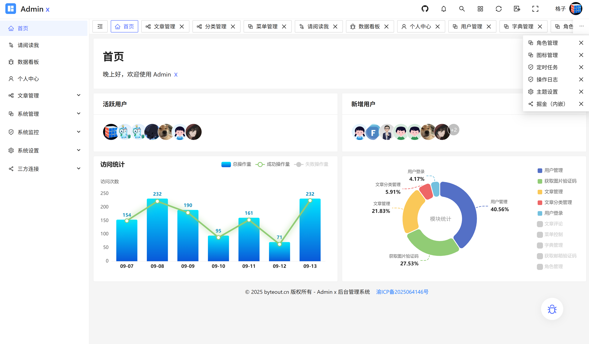

# Admin x

> 一个全场景企业级后台管理模板，集成表单、富文本、可视化图表（ECharts）、拖拽布局、动态表格联动等核心功能，采用模块化设计支持快速扩展，适用于中后台系统开发与前端技术栈实践。技术栈：Vue3 + Vite + TypeScript + Pinia + Ant Design Vue

## 演示地址

https://adminx.byteout.cn

## 交流与反馈

[加入 Byteout 技术交流群](https://qm.qq.com/q/KCSI9GMiE8)

### 贡献者

## 软件架构

软件架构说明

## 安装教程

1. `pnpm install`
2. `npm run dev`
3. `npm run build`

## 参与贡献

1. Fork 本仓库
2. 新建 feat_xxx 分支
3. 提交代码
4. 新建 Pull Request
